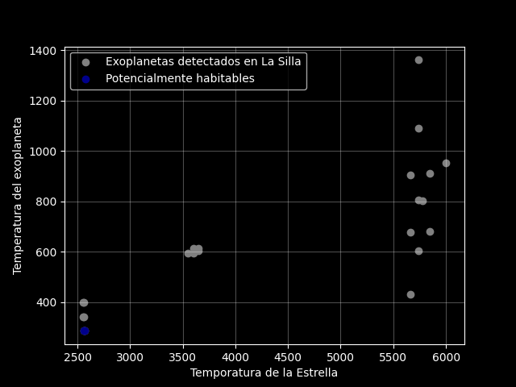

Se construyó un diagrama de dispersión que relaciona la temperatura efectiva de la estrella con la temperatura de equilibrio del exoplaneta. Para este, se realizaron diferentes filtros (algunos restrictivos) con el fin de analizar un conjunto de datos en especifico.

En primer lugar, se realizó un filtro manual por medio de la interfaz web del sitio (NASA Exoplanet Archive) allí, se filtraron los exoplanetas por el instrumento de registro (telescopio terrestre TRAPPIST-South) ubicado en el observatorio de La Silla, en Chile.

Posteriormente se extrajeron diferentes columnas del database Planetary System, tales como nombre del exoplaneta, método de detección, radio y finalmente temperatura de equilibrio del exoplaneta y de estrella.

Finalmente se aplicaron 2 filtros de selección adicionales para obtener un filtro que conlleve una etiqueta tipo 'Mundos Rocosos Templados': 
1. La temperatura del exoplaneta debia estar entre 200 y 300 Kelvin, con el fin de suponer que se podría hallar agua en forma líquida.
2. Radio menor a 2.5 radios terrestre, para tratar de encaminarlo a un tamaño rocoso.

Tras realizar este filtro se encontró un exoplaneta: TRAPPIST-1 d, uno de los miembros del sistema exoplanetario TRAPPIST-1.

En búsqueda de optimizar dicho procedimiento, se creó un ejecutable, encargado de extraer la base de datos del endpoint dado por medio de un consulta SQL, a partir de allí se realizó un filtro que limpiase la base y la exportara a un set de datos limpios y local, donde posteriormente se realizo el calculo estadistico obteniendo que el Radio Promedio para planetas detectados por medio de Velocidad radial es de ~2.75 radios terrestres y por medio de Tránsito el promedio es de ~1.01 radios terrestres.

Finalmente se aplicó por medio del programa 3_analisis.py los filtros correspondientes a la misma seleccion realizada en la interfaz de NASA Exoplanet Archive, obteniendo asi la distribucion de aquellos exoplanetas que se detectaron por medio del telescopio TRAPPIST-South y aquel que cumple todos los filtros realizados se ve de color azul en la gráfica respectivamente.

Tomando como muestra aquellos exoplanetas que se detectaron en La Silla con el telescopio mencionado podriamos tener una pequeña muestra, pues la mayoría de estos exoplanetas se encuentran orbitando estrellas cuya temperatura de equilibrios superior a los 5000k, sin embargo allí habria un sesgo, pues no es una muestra lo suficientemente representativa (son aproximadamente 6000 exoplanetas) en donde el tamaño de estos condiciona su temperatura de igual forma que la temperatura de su estrella.
